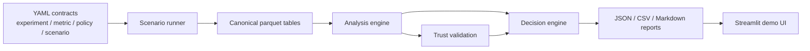
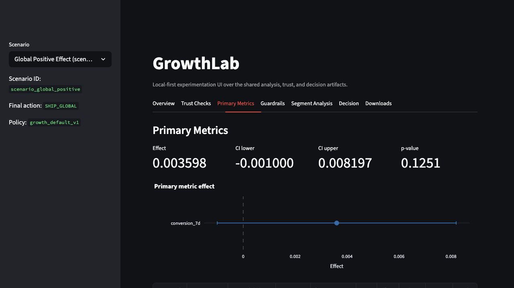
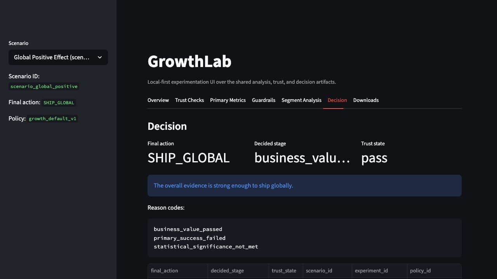

# GrowthLab — Experimentation & Causal Decision Platform

GrowthLab is a local-first experimentation and causal decision platform that turns YAML experiment contracts into synthetic data, trust checks, statistical analysis, policy decisions, and a Streamlit demo.

## Tech Stack Snapshot

- **Core language / packaging:** Python, `pyproject.toml`
- **Data / local analytics:** pandas, NumPy, PyArrow/Parquet
- **Statistical analysis:** SciPy, fixed-horizon A/B analysis, ratio-metric handling, CUPED-style variance reduction
- **Configuration layer:** YAML contracts, Pydantic validation
- **Decisioning:** config-driven policy engine, trust checks, guardrails, segment-aware rollout logic
- **UI / demo:** Streamlit, Plotly, precomputed demo artifacts
- **Engineering quality:** pytest, smoke tests, GitHub Actions CI

## Why This Project Exists

Many experimentation projects stop at a notebook, a single test, or a dashboard. GrowthLab was built to show the full operating loop for product experimentation:

- define an experiment and its metrics in config
- generate canonical synthetic data for realistic scenarios
- run fixed-horizon analysis and variance-reduction logic
- validate whether the read is trustworthy
- apply policy rules for rollout decisions
- package artifacts for review in a local UI

The result is a portfolio project that is closer to an experimentation system than an isolated analysis script, while still staying reproducible on a single machine.

### Current status

- Supported path: synthetic scenario generation → analysis → trust checks → decisioning → Streamlit demo
- Primary demo data: synthetic subscription/growth scenarios
- Benchmark/Criteo ingestion: documented as future scope, not implemented in the current execution path
- Intended use: portfolio-grade local experimentation platform, not a production SaaS system

## What This Project Builds

GrowthLab includes:

- YAML-based experiment, metric, policy, and scenario contracts
- a synthetic scenario runner that writes canonical parquet tables
- a fixed-horizon analysis layer for binary, continuous, and ratio metrics
- a trust layer for SRM, missingness, exposure sanity, maturity, and evaluability
- a decision engine with guardrail, business-value, and segment-policy stages
- reporting exporters that write JSON, CSV, and Markdown artifacts
- a Streamlit UI over prebuilt local demo bundles
- smoke tests and CI checks for the core local workflow

## Architecture / Workflow



### End-to-end flow

1. YAML config under `configs/` defines the experiment, metric registry, policy, and scenario.
2. `scripts/generate_scenario.py` runs the simulator and writes canonical parquet outputs under `data/synthetic/`.
3. `scripts/run_experiment.py` computes metric summaries from parquet inputs.
4. `scripts/run_validation_pack.py` runs trust checks and writes validation artifacts.
5. `scripts/run_decision.py` combines analysis and trust outputs into a final decision summary.
6. `scripts/build_demo_artifacts.py` assembles compact bundles under `reports/demo/`.
7. `scripts/launch_ui.py` starts the Streamlit UI over the prepared artifacts.

## Key Features

### Experimentation and analysis

- Config-driven experiment, metric, policy, and scenario definitions
- Fixed-horizon analysis for binary, continuous, and ratio metrics
- Explicit estimand handling for assigned, opportunity, and exposed views
- CUPED-adjusted estimates when configured covariates are available
- Practical-significance checks alongside p-values and confidence intervals

### Trust and decisioning

- SRM detection
- Missingness checks
- Exposure/opportunity sanity checks
- Maturity and evaluability gating
- Guardrail policy, business-value policy, and pre-registered segment policy

### Demo and engineering

- Streamlit UI with Overview, Trust Checks, Primary Metrics, Guardrails, Segment Analysis, Decision, and Downloads views
- Exported JSON, CSV, and Markdown decision bundles
- Smoke tests for config validation and the end-to-end null scenario
- GitHub Actions CI for install, compile, config validation, and smoke execution

## Technical Implementation

### Core components

| Component | Main files | Responsibility |
| --- | --- | --- |
| Config and contracts | `src/core/`, `configs/` | Load and validate YAML contracts for experiments, metrics, policies, scenarios, and canonical tables |
| Synthetic data generation | `src/simulator/`, `scripts/generate_scenario.py` | Generate experiment tables such as assignments, exposures, outcomes, and validation truth |
| Statistical analysis | `src/analysis/`, `scripts/run_experiment.py` | Compute metric-level inference, lift, intervals, practical thresholds, and CUPED variants |
| Trust validation | `src/validation/`, `scripts/run_validation_pack.py` | Check SRM, missingness, exposure sanity, maturity, and evaluability before decisioning |
| Decisioning | `src/decisioning/`, `scripts/run_decision.py` | Apply ordered policy stages and emit final rollout actions plus reason codes |
| Reporting | `src/reporting/`, `scripts/build_demo_artifacts.py` | Export compact JSON, CSV, and Markdown artifacts for review and UI consumption |
| UI | `src/ui/`, `scripts/launch_ui.py` | Render local demo artifacts in Streamlit with charts and summary views |
| Verification | `tests/smoke/`, `.github/workflows/ci.yml` | Validate config registries and the core local end-to-end workflow |

### Canonical tables written by the simulator

- `dim_experiments.parquet`
- `dim_users.parquet`
- `fact_assignments.parquet`
- `fact_opportunities.parquet`
- `fact_exposures.parquet`
- `fact_user_day.parquet`
- `fact_user_outcomes.parquet`
- `fact_validation_truth.parquet`

## Data / Inputs / Assumptions

- The repo is synthetic-first. The primary committed data path is locally generated experiment data under `data/synthetic/`.
- Scenario behavior is driven by YAML files in `configs/scenarios/`.
- The committed demo bundles under `reports/demo/` are derived local artifacts for five prebuilt scenarios.
- Raw external benchmark ingestion is not implemented in the current execution path; planning/spec docs describe it as future or optional scope.
- No private production data, customer data, or deployment-only data sources are required for the local demo flow.

### Supported scenario library

The current repo includes seven scenario configs:

- `scenario_aa_null`
- `scenario_global_positive`
- `scenario_guardrail_harm`
- `scenario_segment_only_win`
- `scenario_srm_invalid`
- `scenario_low_power_noisy`
- `scenario_delayed_effect`

## Methodology / Approach

GrowthLab uses a config-first experimentation workflow rather than hard-coded analysis logic. The methodology visible in the repo includes:

- fixed-horizon A/B analysis for binary, continuous, and ratio metrics
- explicit treatment-control inference with confidence intervals and p-values
- practical-significance thresholds in addition to statistical significance
- CUPED-based variance reduction when covariates are configured
- trust gating before policy decisions
- pre-registered segment policy with Bonferroni-style correction

This keeps the decisioning layer downstream of both the analysis outputs and the trust state, rather than letting business rules mask invalid experiment reads.

## Evaluation / Results

The repository includes both automated verification and prebuilt scenario outputs.

### Verified checks

| Check | Evidence |
| --- | --- |
| Config smoke validation | `tests/smoke/test_config_smoke.py` verifies 8 metric configs, 1 policy config, 1 experiment config, and 7 scenario configs |
| End-to-end smoke path | `tests/smoke/test_end_to_end_smoke.py` and `scripts/run_smoke_tests.py` generate synthetic data, run validation, run decisioning, and verify `HOLD_INCONCLUSIVE` for `scenario_aa_null` |
| CI coverage | `.github/workflows/ci.yml` installs the package, compiles `src/` and `scripts/`, runs config smoke tests, and executes the end-to-end smoke script |

### Prebuilt demo scenario outcomes

| Scenario | Final action | Evidence |
| --- | --- | --- |
| `scenario_aa_null` | `HOLD_INCONCLUSIVE` | `reports/demo/scenario_aa_null/decision_summary.md` |
| `scenario_global_positive` | `SHIP_GLOBAL` | `reports/demo/scenario_global_positive/decision_summary.md` |
| `scenario_guardrail_harm` | `HOLD_GUARDRAIL_RISK` | `reports/demo/scenario_guardrail_harm/decision_summary.md` |
| `scenario_segment_only_win` | `SHIP_TARGETED_SEGMENTS` | `reports/demo/scenario_segment_only_win/decision_summary.md` |
| `scenario_srm_invalid` | `INVESTIGATE_INVALID_EXPERIMENT` | `reports/demo/scenario_srm_invalid/decision_summary.md` |

### Interpretation

- The repo demonstrates that different synthetic scenarios drive different policy outcomes through the same pipeline.
- The committed result artifacts are useful for walkthroughs, demos, and interview discussion.
- Numeric values in the scenario reports are synthetic experiment outputs, not real business outcomes.

## Demo / Screenshots / Example Outputs

Prebuilt demo artifacts are already included in the repo:

- `reports/demo/manifest.json`
- `reports/demo/<scenario>/analysis_summary.json`
- `reports/demo/<scenario>/trust_summary.json`
- `reports/demo/<scenario>/validation_summary.json`
- `reports/demo/<scenario>/decision_summary.json`
- `reports/demo/<scenario>/decision_summary.md`

Example walkthrough-ready outputs:

- targeted rollout selection in `reports/demo/scenario_segment_only_win/decision_summary.md`
- trust-stop behavior in `reports/demo/scenario_srm_invalid/decision_summary.md`

### Screenshots

The repository also includes two UI screenshots captured from the `scenario_global_positive` demo, which represents a clean positive-treatment case intended to show a favorable rollout outcome.



`primary_metrics_scenario_global_positive.png` shows the main analysis view for the primary success metric. It surfaces the estimated treatment effect, confidence interval bounds, p-value, and the core primary-metric chart, making it the most useful analysis-evidence screen for explaining how the system summarizes experiment performance before decisioning.



`decision_scenario_global_positive.png` shows the final decision layer for the same positive scenario. It highlights the rollout action `SHIP_GLOBAL`, the decision stage, trust state, and the reason codes behind the outcome, making it the most useful executive-summary screen for showing how analysis is translated into an operational recommendation.

Additional screenshot guidance and walkthrough notes are available in:

- `assets/screenshots/README.md`
- `docs/demo/demo_checklist.md`
- `docs/demo/demo_script.md`

## Quickstart

### Prerequisites

- Python 3.11+

### Install

```bash
git clone git@github.com:SNCA-24/growthlab-experimentation-platform.git
cd growthlab-experimentation-platform
python3 -m venv .venv
source .venv/bin/activate
python3 -m pip install --upgrade pip
python3 -m pip install -e .
```

### Run smoke verification

```bash
python3 scripts/run_smoke_tests.py
```

Expected success line:

```text
smoke tests passed: config loading, generation, validation, decisioning
```

Note: in restricted macOS or sandboxed environments, PyArrow may emit non-fatal `sysctlbyname` warnings before the success line.

### Generate a scenario

```bash
python3 scripts/generate_scenario.py \
  --scenario configs/scenarios/scenario_aa_null.yaml \
  --output-dir data/synthetic/scenario_aa_null
```

### Run analysis

```bash
python3 scripts/run_experiment.py \
  --experiment-config configs/experiments/exp_onboarding_v1.yaml \
  --metric-registry configs/metrics \
  --input-parquet-dir data/synthetic/scenario_aa_null \
  --output-dir reports/analysis/scenario_aa_null
```

### Run validation

```bash
python3 scripts/run_validation_pack.py \
  configs/scenarios/scenario_aa_null.yaml \
  --output-dir reports/validation
```

### Run decisioning

```bash
python3 scripts/run_decision.py \
  --experiment-config configs/experiments/exp_onboarding_v1.yaml \
  --policy-config configs/policies/growth_default_v1.yaml \
  --analysis-summary reports/validation/scenario_aa_null/analysis_summary.json \
  --trust-summary reports/validation/scenario_aa_null/validation_summary.json \
  --output-dir reports/decision/scenario_aa_null
```

### Build demo artifacts and launch the UI

```bash
python3 scripts/build_demo_artifacts.py --output-dir reports/demo
python3 scripts/launch_ui.py
```

The UI runs locally in headless Streamlit mode and reads prepared artifacts from `reports/demo/`.

## Repository Structure

```text
growthlab/
├── configs/
│   ├── experiments/
│   ├── metrics/
│   ├── policies/
│   └── scenarios/
├── data/
│   └── synthetic/
├── docs/
│   ├── architecture/
│   ├── decisions/
│   ├── demo/
│   └── specs/
├── reports/
│   ├── analysis/
│   ├── decision/
│   └── demo/
├── scripts/
├── src/
│   ├── analysis/
│   ├── core/
│   ├── decisioning/
│   ├── reporting/
│   ├── simulator/
│   ├── ui/
│   └── validation/
├── tests/
│   └── smoke/
├── assets/
├── pyproject.toml
└── README.md
```

## Ownership and Scope

This project includes repo-specific implementation for:

- the YAML contract and validation layer under `src/core/` and `configs/`
- the synthetic scenario runner and canonical parquet outputs under `src/simulator/`
- the analysis, trust-validation, and decisioning pipeline under `src/analysis/`, `src/validation/`, and `src/decisioning/`
- the reporting/export path under `src/reporting/`
- the Streamlit demo UI under `src/ui/`
- the local scripts, smoke tests, and CI workflow under `scripts/`, `tests/smoke/`, and `.github/workflows/`

Planning and product-spec documents in `docs/specs/` discuss additional ideas such as benchmark ingestion and a sibling FastAPI interface. Those items are not part of the visible committed execution path in this repository and should be treated as planned or optional scope rather than implemented features.

This repository is positioned as a local-first portfolio and interview project. It does not claim production deployment, external customer usage, or infrastructure that is not present in the repo.

## Design Decisions and Tradeoffs

| Decision | Why | Tradeoff / Alternative |
| --- | --- | --- |
| Synthetic-first scenario generation | Keeps the project reproducible, local, and easy to demo without external data access | Less representative than a real production dataset or live experimentation logs |
| Canonical parquet tables between stages | Cleanly separates simulation, analysis, validation, reporting, and UI consumption | Adds artifact-management steps compared with an in-memory-only flow |
| Trust checks before policy decisions | Prevents rollout logic from masking invalid experiment reads such as SRM or missingness failures | Makes the decision path stricter and intentionally blocks some otherwise favorable synthetic outcomes |
| Precomputed demo artifacts for the UI | Keeps the Streamlit app fast and review-friendly on a single machine | The UI is a viewer over prepared outputs rather than a live recomputation surface |
| Pre-registered segment policy in v1 | Demonstrates targeted rollout logic with explicit boundaries and correction rules | Narrower than a richer exploratory segmentation workflow |
| Local-first single-machine scope | Optimizes for portfolio review, reproducibility, and interview walkthroughs | Does not demonstrate hosted deployment, distributed compute, or production auth/operations concerns |

## Limitations and Honest Scope

- This project demonstrates a local experimentation workflow with synthetic scenarios, but does not claim production deployment or real customer-facing usage.
- The primary committed data path is synthetic and scenario-driven rather than sourced from a real production event stream.
- A sibling FastAPI interface and benchmark-ingestion ideas appear in planning documents, but they are not implemented in the committed execution path described here.
- No observational causal methods or Bayesian experimentation workflow are included.
- Segment decisioning is limited to the current pre-registered policy flow.
- The repo favors local reproducibility and artifact-based review over cloud infrastructure, distributed execution, or operational hardening.

## Future Improvements

- Add a real benchmark ingestion path if external data usage is in scope
- Add a lightweight programmatic API over the shared Python core
- Expand low-power and delayed-effect scenario walkthroughs in the demo surface
- Add richer evaluation summaries or comparison dashboards across scenarios
- Extend the decision engine with additional experimentation policies once the current local scope is stable

## Skills Demonstrated

### Experimentation / Causal Measurement

- fixed-horizon A/B analysis for binary, continuous, and ratio metrics
- CUPED-style variance reduction with configured pre-treatment covariates
- practical-significance-aware interpretation using p-values, confidence intervals, and decision thresholds
- explicit estimand handling across assigned, opportunity, and exposed analysis views

### Data / Analytics Engineering

- YAML-driven experiment, metric, policy, and scenario registries
- canonical Parquet outputs for simulation, analysis, validation, reporting, and UI consumption
- scenario-based validation across null, positive, harmful, underpowered, and invalid experiment cases
- trust checks for SRM, missingness, maturity, exposure sanity, and evaluability

### Engineering / Systems

- modular Python pipeline across simulation, analysis, validation, decisioning, reporting, and UI layers
- Pydantic-backed contract validation and fail-fast configuration loading
- CLI-based local workflows for generation, analysis, validation, decisioning, and demo artifact packaging
- smoke tests and GitHub Actions CI for reproducible verification
- Streamlit dashboard over precomputed analytical artifacts

### Product / Business Decisioning

- trust-before-decision architecture for experiment review
- guardrail-aware and business-value-aware rollout framing
- pre-registered segment-aware rollout recommendations
- stakeholder-readable decision summaries and demo artifacts
- explicit local-first scope boundaries for an interview-ready experimentation platform
