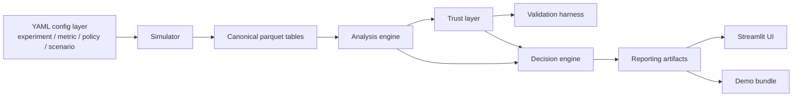

# GrowthLab

GrowthLab is a local-first, config-driven experimentation platform that turns YAML experiment contracts into synthetic data, trust checks, analysis, policy decisions, and a Streamlit demo in one reproducible repo.

## Why this project matters
Most experimentation demos stop at a chart or a notebook. GrowthLab shows the full operating loop:
- contracts define the experiment
- a synthetic DGP generates canonical tables
- analysis estimates the effect
- trust checks gate bad reads
- policy rules decide what to do next
- UI and reports make the result explorable

That makes it useful as a portfolio project because it demonstrates the full path from specification to decision, not just isolated analytics code.

## What the system does
GrowthLab supports:
- YAML-based experiment, metric, policy, and scenario contracts
- synthetic-first generation of canonical parquet tables
- fixed-horizon analysis for binary, continuous, and ratio metrics
- trust-layer validation for SRM, missingness, exposure sanity, maturity, and evaluability
- config-driven decisioning with guardrails, business value, and segment policy
- a Streamlit UI over precomputed demo artifacts

## Architecture overview


The same shared Python core powers:
- generation
- analysis
- trust validation
- decisioning
- reporting
- local UI inspection

## Core concepts covered
- Config-first experimentation
  - experiments, metrics, policies, and scenarios are YAML contracts
- Canonical tables
  - synthetic outputs follow the repo's table contracts
- Estimands
  - assigned, opportunity, and exposed views are explicit
- Trust and decision separation
  - invalid experiments stop at trust before policy logic runs
- Practical significance
  - policy decisions are not based on p-values alone
- Segment policy
  - only pre-registered segment logic is supported in v1

## Repo structure
Key directories:
- `configs/`
  - source-of-truth YAML contracts
- `data/`
  - synthetic, raw, benchmark, and processed data locations
- `src/core/`
  - contracts, config loaders, validators, and filter compiler
- `src/simulator/`
  - synthetic DGP and scenario runner
- `src/analysis/`
  - fixed-horizon statistical analysis
- `src/validation/`
  - trust layer and validation harness
- `src/decisioning/`
  - policy engine and final decisioning
- `src/reporting/`
  - summary tables, charts, and export helpers
- `src/ui/`
  - Streamlit application
- `docs/`
  - architecture, demo notes, and design decisions
- `docs/demo/`
  - demo script, demo checklist, release prep, and readiness notes
- `reports/demo/`
  - ready-to-open demo artifacts

## Quickstart
```bash
python3 -m pip install -e .
```

```bash
python3 scripts/run_smoke_tests.py
```

```bash
python3 scripts/build_demo_artifacts.py --output-dir reports/demo
```

```bash
python3 scripts/launch_ui.py
```

## How to generate scenarios
Generate a single scenario into canonical parquet tables:

```bash
python3 scripts/generate_scenario.py \
  --scenario configs/scenarios/scenario_aa_null.yaml \
  --output-dir data/synthetic/scenario_aa_null
```

Supported starter scenarios:
- `scenario_aa_null`
- `scenario_global_positive`
- `scenario_guardrail_harm`
- `scenario_segment_only_win`
- `scenario_srm_invalid`
- `scenario_low_power_noisy`
- `scenario_delayed_effect`

## How to run analysis, validation, and decisioning
Analysis:

```bash
python3 scripts/run_experiment.py \
  --experiment-config configs/experiments/exp_onboarding_v1.yaml \
  --metric-registry configs/metrics \
  --input-parquet-dir data/synthetic/scenario_aa_null \
  --output-dir reports/analysis/scenario_aa_null
```

Validation:

```bash
python3 scripts/run_validation_pack.py \
  configs/scenarios/scenario_aa_null.yaml \
  --output-dir reports/validation
```

Decisioning:

```bash
python3 scripts/run_decision.py \
  --experiment-config configs/experiments/exp_onboarding_v1.yaml \
  --policy-config configs/policies/growth_default_v1.yaml \
  --analysis-summary reports/validation/scenario_aa_null/analysis_summary.json \
  --trust-summary reports/validation/scenario_aa_null/validation_summary.json \
  --output-dir reports/decision/scenario_aa_null
```

## How to launch the UI
Build the demo bundle first:

```bash
python3 scripts/build_demo_artifacts.py --output-dir reports/demo
```

Then launch Streamlit:

```bash
python3 scripts/launch_ui.py
```

The UI reads local artifacts directly from `reports/demo/` and shows:
- Overview
- Trust Checks
- Primary Metrics
- Guardrails
- Segment Analysis
- Decision
- Downloads

## Scenario library summary
| Scenario | What it validates | Expected decision |
| --- | --- | --- |
| `scenario_aa_null` | Null behavior, trust validity, and false-positive control | `HOLD_INCONCLUSIVE` |
| `scenario_global_positive` | Clean win recovery and global ship behavior | `SHIP_GLOBAL` |
| `scenario_guardrail_harm` | Guardrail gating when the primary metric improves but a guardrail fails | `HOLD_GUARDRAIL_RISK` |
| `scenario_segment_only_win` | Targeted rollout on pre-registered segments | `SHIP_TARGETED_SEGMENTS` |
| `scenario_srm_invalid` | Assignment integrity failure and trust stop | `INVESTIGATE_INVALID_EXPERIMENT` |
| `scenario_low_power_noisy` | Underpowered / rerun behavior | `RERUN_UNDERPOWERED` |
| `scenario_delayed_effect` | Interim vs final reads and delayed lift | final decision after maturity |

## Example outputs and screenshots
Prebuilt demo artifacts live in `reports/demo/`.

Useful files:
- `reports/demo/manifest.json`
- `reports/demo/<scenario>/analysis_summary.json`
- `reports/demo/<scenario>/trust_summary.json`
- `reports/demo/<scenario>/validation_summary.json`
- `reports/demo/<scenario>/decision_summary.json`
- `reports/demo/<scenario>/decision_summary.md`

Screenshot capture guidance:
- see `assets/screenshots/README.md`
- capture the Overview, Trust Checks, Primary Metrics, and Decision pages
- use one null scenario and one positive scenario for comparison

Release prep:
- `docs/demo/release_prep.md`
- `publish_readiness_report.md`

## Design choices and tradeoffs
- Synthetic-first DGP
  - keeps the repo deterministic, local, and fully reproducible
- Canonical parquet outputs
  - make the analysis and UI layers independent of the simulator internals
- Trust before decision
  - prevents policy logic from masking invalid experiments
- Compact demo bundle
  - keeps the UI fast enough for a 16 GB laptop demo
- Single policy path in v1
  - demonstrates rigor without pretending to solve every rollout policy in production

## Limitations and future work
GrowthLab intentionally does not include:
- Criteo ingestion or benchmark ETL
- observational causal methods
- Bayesian methods
- advanced segment policy execution
- production auth/RBAC
- cloud deployment infrastructure

The current repo is a strong local demo and interview artifact, not a production experimentation platform.
