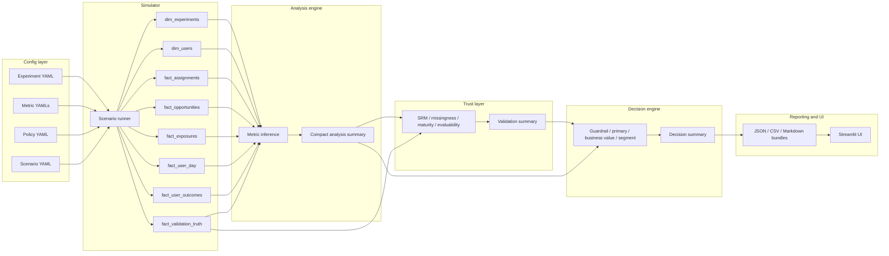

# GrowthLab System Overview

GrowthLab is organized as a strict pipeline:

1. YAML contracts define the experiment, metrics, policy, and scenario.
2. The simulator converts the scenario into canonical parquet tables.
3. The analysis engine estimates the configured metric effects.
4. The trust layer validates the read before policy logic runs.
5. The decision engine applies policy stages in order.
6. Reporting exports compact artifacts for UI and review.
7. Streamlit reads those artifacts locally for demo and exploration.

## Artifact flow

## Design notes
- The simulator writes all canonical tables in the same order expected by the contracts.
- The analysis engine only consumes parquet and the metric registry.
- Trust checks are reusable by the validation harness and policy engine.
- The decision engine is config-driven and does not need to recompute statistics.
- The UI is a viewer over prepared artifacts, not a hidden source of business logic.

